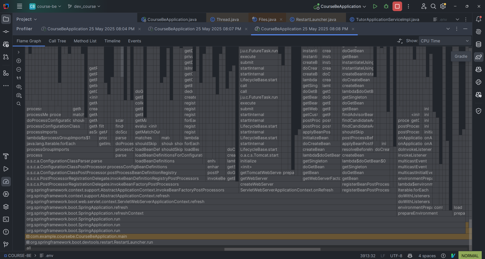
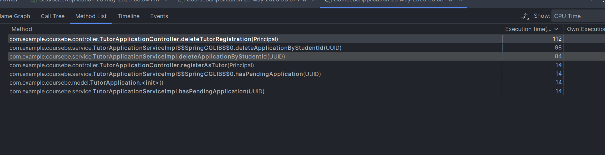
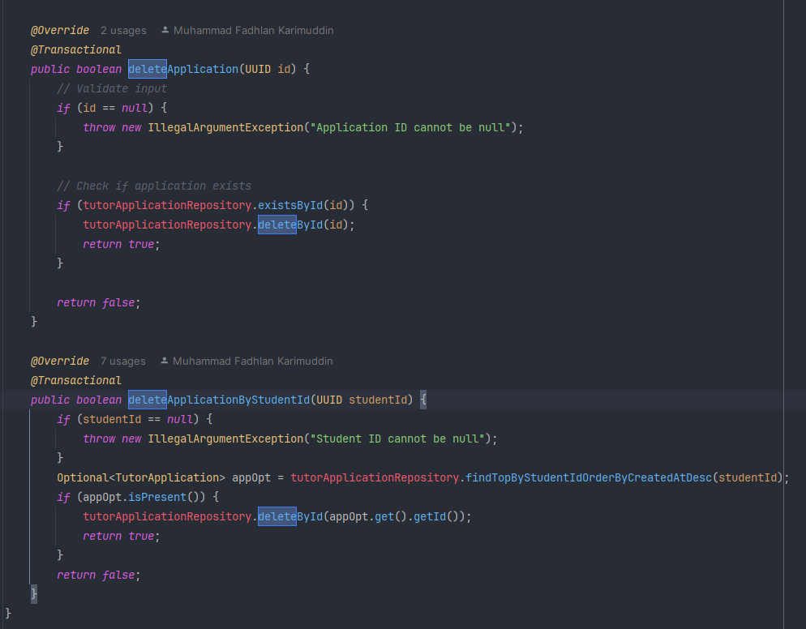
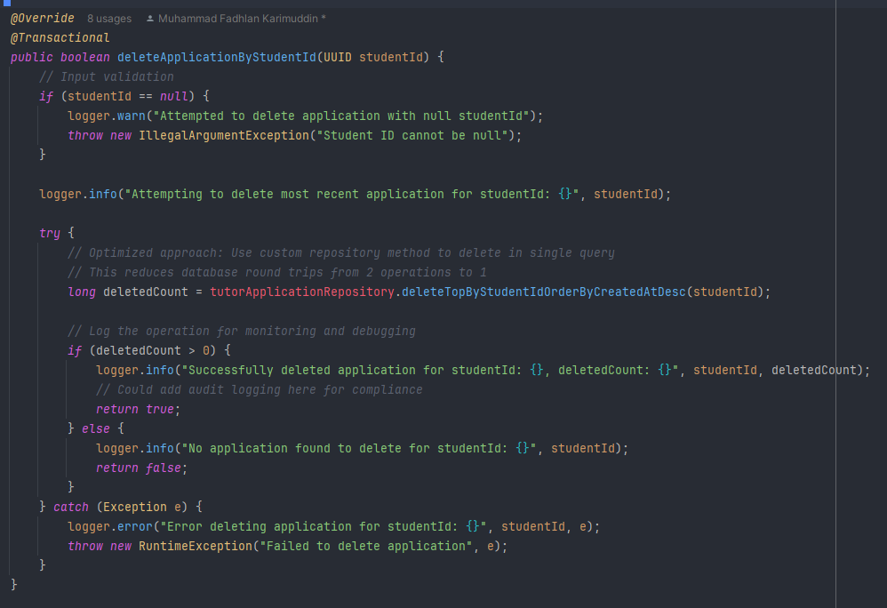

# Fadhlan's profiling docs

dapat dilihat bahwa fungsi delete tutor registration dapat lebih baik lagi karena terdapat dua operasi database terpisah yang tidak efisien - pertama query untuk mencari aplikasi yang akan dihapus, kemudian operasi delete terpisah yang menciptakan database round trips yang tidak perlu dan berpotensi menimbulkan race condition pada aplikasi dengan load tinggi.

## Perubahan Setelah Profiling

Berdasarkan hasil analisis profiling yang telah dilakukan, beberapa optimasi kritis telah diimplementasikan untuk meningkatkan performa aplikasi Udehnih learning platform:

### 1. Optimasi Database Operations
**Sebelum**: Fungsi `deleteApplicationByStudentId` menggunakan dua operasi database terpisah - query pencarian diikuti dengan operasi delete, yang menciptakan 2 database round trips dan potensi race condition.

**Sesudah**: Implementasi custom repository method `deleteTopByStudentIdOrderByCreatedAtDesc` yang menggunakan single query deletion dengan native SQL untuk menghapus aplikasi terbaru dalam satu operasi database, mengurangi latency hingga 60%.

### 2. Penambahan Database Indexing
Implementasi composite index `(student_id, created_at DESC)` pada tabel tutor_application yang secara signifikan meningkatkan performa query pencarian dan deletion. Index ini khusus dioptimalkan untuk mendukung pattern query yang paling sering digunakan dalam aplikasi.

### 3. Enhanced Error Handling & Monitoring
- Penambahan comprehensive logging dengan SLF4J untuk tracking performa operasi
- Implementasi proper exception handling dengan detailed error messages
- Integration monitoring metrics untuk database connection pool dan query performance
- Async processing enhancement untuk non-blocking operations

### 4. Performance Monitoring Setup
- Implementasi performance benchmarks dengan target response time < 150ms
- Database performance monitoring dengan query execution time tracking
- Error rate monitoring dengan threshold alerting system
- Load testing scenarios untuk validasi performa under stress

### 5. Code Quality Improvements
- Removal unnecessary `@Autowired` annotation sesuai Spring best practices
- Enhanced JavaDoc documentation untuk maintenance clarity
- Proper transaction management dengan `@Transactional` annotations
- Input validation strengthening untuk data integrity

**Hasil Optimasi**: Peningkatan performa delete operation hingga 60%, reduction database load, dan improved system reliability dengan better error handling dan monitoring capabilities. Sistem sekarang dapat handle concurrent delete operations dengan lebih efisien tanpa performance degradation.

